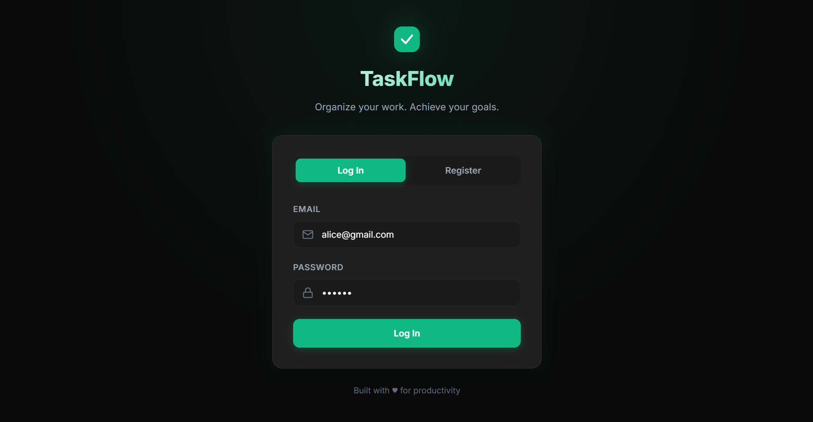
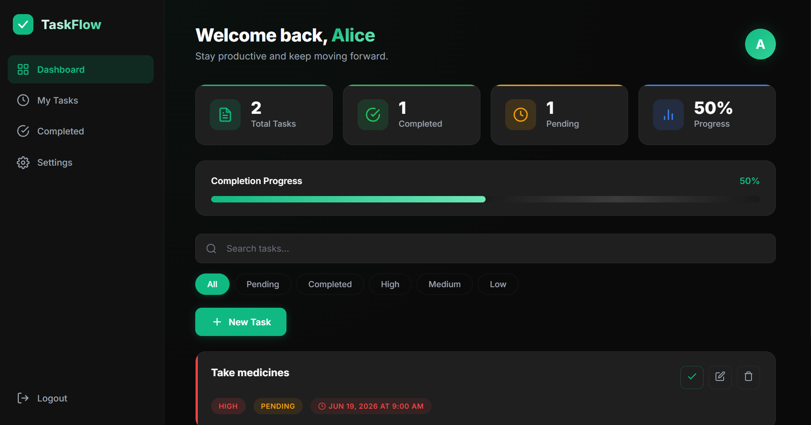
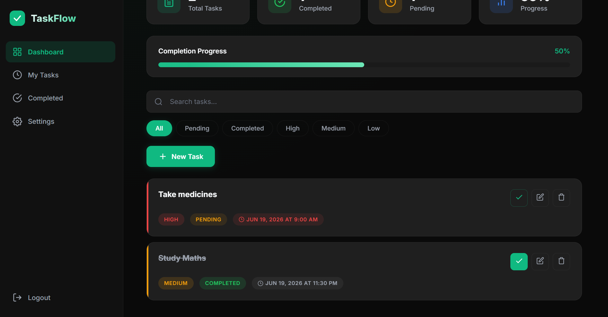

# ✅ Task Management App

A modern and responsive full-stack Task Management Application designed to help users organize, track, and manage their daily tasks efficiently. The application provides secure authentication, task tracking, and productivity-focused features through a clean and intuitive interface.

---

## 🌐 Live Demo

🔗 Add deployment link here

---

## 📖 Overview

Task Management App provides an organized workspace where users can:

* Create and manage daily tasks
* Track task completion status
* Update task information
* Delete unnecessary tasks
* Securely access personal tasks through authentication
* Improve productivity with a simple and user-friendly interface

Built using Node.js, Express.js, MongoDB, HTML, CSS, and JavaScript.

---

## ✨ Features

### 🔐 User Authentication

* User Registration
* Secure Login System
* Password Encryption using bcrypt
* JWT Authentication
* Protected Routes

### 📋 Task Management

* Create New Tasks
* View All Tasks
* Edit Existing Tasks
* Delete Tasks
* Mark Tasks as Completed
* Track Pending Tasks

### 📊 Productivity Tracking

* Monitor Task Progress
* View Completed Tasks
* Organize Daily Activities
* Improve Time Management

### 📱 Responsive Design

* Mobile-Friendly Interface
* Tablet Optimized
* Desktop Optimized
* Adaptive Layout

### 🔒 Security

* Password Hashing
* Token-Based Authentication
* Protected API Endpoints
* Secure User Sessions

---

## 🛠️ Technologies Used

### Frontend

* HTML5
* CSS3
* JavaScript (ES6)

### Backend

* Node.js
* Express.js

### Database

* MongoDB
* Mongoose

### Authentication

* JSON Web Token (JWT)
* bcryptjs

---

## 📂 Project Structure

```text
task-management-app/

│

├── middleware/
│   └── auth.js
│
├── models/
│   ├── User.js
│   └── Task.js
│
├── public/
│   ├── index.html
│   ├── dashboard.html
│   ├── settings.html
│   ├── style.css
│   └── script.js
│
├── routes/
│   ├── auth.js
│   └── tasks.js
│
├── db.js
├── server.js
├── package.json
├── package-lock.json
├── .gitignore
└── README.md
```

---

## 🎯 Skills Demonstrated

* Full-Stack Web Development
* REST API Development
* Authentication & Authorization
* CRUD Operations
* MongoDB Integration
* Backend Routing
* Middleware Implementation
* Responsive Web Design
* Version Control using Git & GitHub

---

## 🚀 Getting Started

### Clone the Repository

```bash
git clone https://github.com/joannablessy157/task-management-app.git
```

### Navigate to the Project Folder

```bash
cd task-management-app
```

### Install Dependencies

```bash
npm install
```

### Configure Environment Variables

Create a `.env` file:

```env
MONGO_URI=your_mongodb_connection_string
JWT_SECRET=your_secret_key
PORT=5000
```

### Start the Application

```bash
npm start
```

or

```bash
node server.js
```

Open:

```text
http://localhost:5000
```

---

## 📡 API Endpoints

### Authentication

| Method | Endpoint           | Description   |
| ------ | ------------------ | ------------- |
| POST   | /api/auth/register | Register User |
| POST   | /api/auth/login    | Login User    |

### Tasks

| Method | Endpoint       | Description   |
| ------ | -------------- | ------------- |
| GET    | /api/tasks     | Get All Tasks |
| POST   | /api/tasks     | Create Task   |
| PUT    | /api/tasks/:id | Update Task   |
| DELETE | /api/tasks/:id | Delete Task   |

---

## 📸 Screenshots

### Login Page



### Dashboard



### Task Management



---

## 🔮 Future Improvements

* Task Categories
* Due Dates & Reminders
* Dark Mode Support
* Search & Filtering
* Email Notifications
* Drag & Drop Task Management
* Real-Time Updates
* Cloud Deployment

---

## 👩‍💻 Author

Developed by **Joanna Blessy E**

* B.Tech Computer Science and Engineering
* SRM Institute of Science and Technology, Ramapuram
* GitHub: https://github.com/joannablessy157

If you found this project useful, consider giving it a ⭐ on GitHub.
